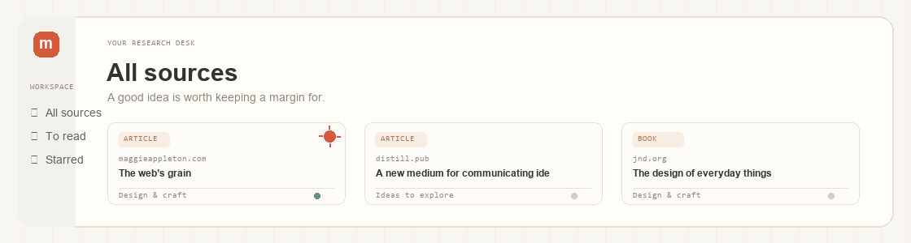
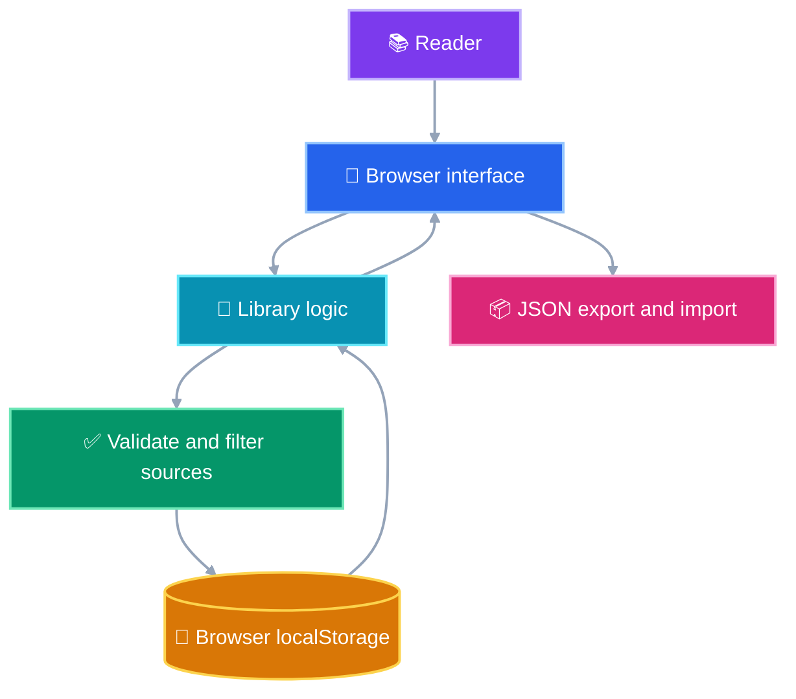

<div align="center">
  
  <h1>Margin</h1>
  <p><strong>A little room for the ideas you want to keep.</strong><br>A calm, local-first reading desk for saving sources, writing notes, and keeping research moving.</p>

  <p>
    
    
    
    
    
  </p>
</div>

<p align="center"><em>Collect what catches your attention. Leave yourself a note. Find your way back.</em></p>

---

## 🗂️ What is Margin?

Margin is a small, account-free library for the links, papers, books, videos, and ideas you want to return to. Save a source, file it into a collection, keep a note beside it, and pick up where you left off.

The app runs in your browser. Your library stays in that browser's local storage and is not sent to the public repository or to a Margin server. There is no account or sync service; use the built-in JSON backup to move your library between devices.

### ✨ Highlights

| Capability | What it does |
|---|---|
| Source library | Keep articles, papers, books, videos, podcasts, and other web sources together. |
| Search and filters | Find sources by title, link, description, collection, or note; filter by type, status, collection, and star. |
| Personal annotations | Write a private note beside a source; changes save locally as you type. |
| Reading progress | Track unread and finished sources, notes, and starred items. |
| Portable backups | Export a versioned JSON backup and restore it after validation. |
| Focused interface | Use responsive card and list views, keyboard search (`Ctrl/⌘ K`), and reduced-motion support. |

---

## ✨ Core Experience

`Save a source  →  Organize it  →  Find it again  →  Add a note  →  Keep it on your device`

The first visit includes four sample sources so the interface is easy to explore. They are examples only; they are not merged into an existing saved library. Clear the library to start fresh.

---

## 🧰 Tech Stack

| Area | Choice | Purpose |
|---|---|---|
| Language | JavaScript ES modules | Library logic and browser interactions |
| Interface | HTML + CSS | Responsive, semantic, dependency-free UI |
| Runtime | Node.js 20+ | Local static server and built-in test runner |
| Storage | Browser `localStorage` | Keep each browser profile's library on that device |
| External services | None | No account, API key, analytics, or backend required |
| Tests | `node:test` | Cover URL safety, validation, search, filters, and statistics |
| CI | GitHub Actions | Run tests and syntax checks on pushes and pull requests |

---

## 🧭 Project Structure



### 📂 Repository layout

```text
margin/
├── .github/workflows/quality.yml  # Test and syntax-check workflow
├── assets/                        # Project mark, banner, and README badges
├── scripts/server.mjs             # Dependency-free local web server
├── src/
│   ├── app.js                      # UI rendering and browser interactions
│   └── library.js                  # Source model, validation, search, statistics
├── tests/library.test.js           # Core library behavior tests
├── .env.example                    # No environment variables currently needed
├── CONTRIBUTING.md
├── index.html
├── LICENSE
├── package.json
├── README.md
├── SECURITY.md
└── styles.css
```

---

## 🚀 Getting Started

### Requirements

- Node.js 20 or newer
- No npm dependencies to install

### Run locally

```bash
git clone https://github.com/m-akmal728/margin.git
cd margin
npm run dev
```

Open the local address printed by the server (by default, `http://127.0.0.1:4173`). You can also run `npm start`. Set `PORT` before running the server to use a different port.

### Use Margin

1. Select **Add source** and enter a title and an `http://` or `https://` link.
2. Choose a source type and collection; add a short reason to return if you like.
3. Search or filter the library. Open a source card to add a note, star it, visit the original, or mark it read.
4. Open **Data & settings** to export or restore a backup.

---

## 🛡️ Privacy & Data

- Each browser profile has its own local library. Sources and notes are not uploaded or shared with other users.
- Margin has no account, backend, analytics, tracking, external previews, or outgoing library requests.
- Using another device starts with that device's own browser storage. To transfer your library, export a JSON backup and import it on the other device.
- Anyone with access to the same browser profile can access its local data. Use a separate profile on shared devices.
- Treat exported JSON backups as private. Imports are validated before replacing the current library.
- Source links must use HTTP or HTTPS and open with `noopener noreferrer`.

See [`SECURITY.md`](SECURITY.md) for reporting a security concern. There are no API keys or secrets; `PORT` is the only optional local server setting. See [`.env.example`](.env.example).

---

## 🧪 Testing

```bash
npm test
npm run check
```

The test suite covers secure URL schemes, source creation and validation, reading and notes statistics, combined filters and sorting, and imported backup validation. `npm run check` parses the app, library, and server JavaScript. GitHub Actions runs both commands on pushes and pull requests.

---

## 🗺️ Roadmap

### Complete

- Local source library, collections, notes, starred items, and reading status
- Search, type filters, sorting, responsive grid/list display, and progress summary
- Versioned JSON backup and restore
- Accessible dialogs, keyboard search, reduced-motion support, and empty states
- Core logic tests and GitHub Actions checks

### Possible next steps

- Browser share target or bookmarklet for faster capture
- Citation export in common academic formats
- Optional encrypted backup format
- Search within highlighted passages

---

## 🤝 Contributing

Small, focused contributions are welcome. Read [`CONTRIBUTING.md`](CONTRIBUTING.md), run the test and check commands, and describe the behavior changed in your pull request.

## 📄 License

Distributed under the [MIT License](LICENSE).

---

<div align="center">
  Built with care by <a href="https://github.com/m-akmal728">@m-akmal728</a>
</div>
