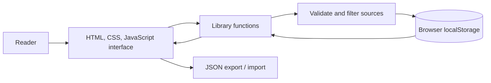
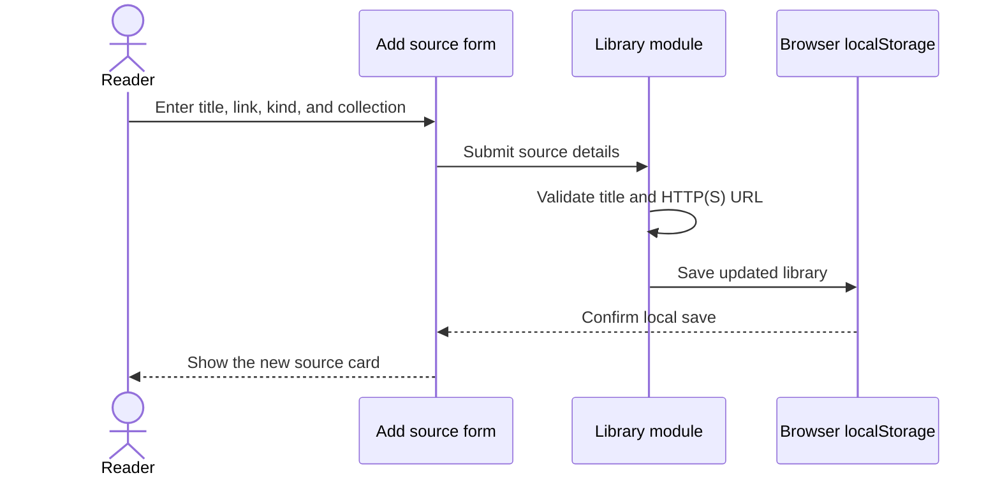

<div align="center">
  
  <h1>Margin</h1>
  <p><strong>A little room for the ideas you want to keep.</strong><br>A calm, local-first reading desk for saving sources, writing notes, and keeping research moving.</p>

  <p>
    
    
    
    
    
  </p>
</div>

<p align="center"><em>Collect what catches your attention. Leave yourself a note. Find your way back.</em></p>

---

## Why Margin?

Interesting things show up everywhere: a paper linked in a lecture, an essay someone mentioned, a book you mean to read. Margin gives them a home. Save a source, sort it into a collection, mark it for later or as read, and keep your own notes beside it.

The library lives in your browser. There is no account, server, or API key to set up; export a JSON backup when you want a portable copy.

## At a glance

| Find your next read | Keep the useful thought |
|:--:|:--:|
| Search titles, links, descriptions, collections, and notes. Filter by source type, reading status, collection, or star. | Add a private annotation beside any saved source, keep reading momentum visible, and export or restore your whole library. |

## Features

- **Capture in a moment** — save a link with a title, source kind, collection, and a short reason to return.
- **A library that makes sense to you** — keep articles, papers, books, videos, podcasts, and other web sources together.
- **Useful ways to browse** — search every source field, filter by kind, switch between recent and recently updated, and view starred or unread items.
- **Notes beside the source** — open any card to write an annotation; it is saved locally as you type.
- **Small signs of progress** — see how many sources are still unread, how many have notes, and what share you have finished.
- **Portable by default** — download a JSON backup and restore it later, with schema and URL validation on import.
- **Responsive, quiet interface** — warm paper tones, focused card layouts, keyboard search (`Ctrl/⌘ K`), and reduced-motion support.
- **Privacy by design** — no tracking, analytics, authentication, backend, external content previews, or outgoing library requests.

## Preview

The animated banner above is generated for this project; it is an illustration, not a screenshot. The application opens on a populated sample library so the main workflow is easy to explore. The sample links are examples; your own saved library is stored separately in your browser.

## Technology

| Area | Choice | Purpose |
|---|---|---|
| Language | JavaScript (ES modules) | UI behavior and portable library logic |
| Interface | HTML + CSS | Semantic, responsive, dependency-free interface |
| Runtime | Node.js 20+ | Tiny local static server and built-in test runner |
| Storage | Browser `localStorage` | Save the library locally without an account or server |
| External APIs | None | Margin does not need network services to manage a library |
| Tests | `node:test` | Cover URL safety, validation, filtering, sorting, and statistics |
| CI | GitHub Actions | Run tests and JavaScript syntax checks on pushes and pull requests |

## How it works



### Saving a source



The app reads the existing versioned library from `localStorage` at launch, or shows a sample library on first use. Source links must use HTTP or HTTPS. Searches and filters run against the local library. Editing a note, changing reading status, or starring an item writes the updated library to browser storage. Import replaces the current library only after confirmation and validation; export downloads the versioned JSON data.

## Project structure

```text
margin/
├── .github/workflows/quality.yml  # Test and syntax-check workflow
├── assets/
│   ├── banner.gif                 # Original animated README illustration
│   ├── badges/                    # Static, locally stored README badges
│   └── mark.svg                   # Project mark and browser favicon
├── scripts/server.mjs             # Dependency-free local web server
├── src/
│   ├── app.js                     # UI rendering and browser interactions
│   └── library.js                 # Source model, validation, search, statistics
├── tests/library.test.js          # Core library behavior tests
├── .env.example                   # No environment variables currently needed
├── .gitignore
├── CONTRIBUTING.md
├── index.html
├── LICENSE
├── package.json
├── README.md
├── SECURITY.md
└── styles.css
```

## Run locally

**Requirements:** Node.js 20 or newer. Margin has no npm dependencies.

```bash
git clone https://github.com/m-akmal728/margin.git
cd margin
npm run dev
```

Open the local address printed by the server (by default, `http://127.0.0.1:4173`). To change the port, set `PORT` before running the command. You can also run `npm start`.

## Use Margin

1. Choose **Add source** and paste a title and an `http://` or `https://` link.
2. Choose what kind of source it is and where to file it. Add a short reason to remember it, if useful.
3. Search or filter your library; select a card to annotate it, star it, open the original, or mark it read.
4. Open **Data & settings** to export or restore a backup.

The first visit shows four sample sources to make the interface legible. They are not merged into an existing saved library. Clearing the library returns to an empty state.

### Environment variables

No environment variables are required. `PORT` is an optional setting for the local development server and defaults to `4173`. There are no API keys or secrets. See [`.env.example`](.env.example).

## Tests and checks

```bash
npm test
npm run check
```

The test suite covers secure URL schemes, source creation and validation, reading and notes statistics, combined filters and sorting, and imported backup validation. `npm run check` parses the app, library, and server JavaScript. GitHub Actions runs both commands on pushes and pull requests.

## Security and data

Margin does not upload your sources or notes. The local server serves static files on `127.0.0.1`; the browser stores the library in `localStorage`. Anyone using the same browser profile can access its data, so avoid shared profiles for sensitive material. Treat exported JSON backups as private. Imported backups are checked for a supported schema, unique IDs, and safe web URLs. Saved links open with `noopener noreferrer`. Review [`SECURITY.md`](SECURITY.md) before reporting a concern.

## Roadmap

### Complete

- Local source library, collections, annotations, starred items, and reading state
- Search, type filters, sorting, responsive grid/list display, and progress summary
- Versioned JSON backup and restore
- Accessible dialogs, keyboard search, reduced-motion support, and empty states
- Core logic tests and GitHub Actions checks

### Possible next steps

- Browser share-target or bookmarklet for faster capture
- Citation export in common academic formats
- Optional encrypted backup format
- Search within highlighted passages

## Contributing

Small, focused contributions are welcome. Start with the steps in [`CONTRIBUTING.md`](CONTRIBUTING.md), run the test and check commands, and describe the behavior you changed in your pull request.

## License

Distributed under the [MIT License](LICENSE).

## Author

Created by [@m-akmal728](https://github.com/m-akmal728).
